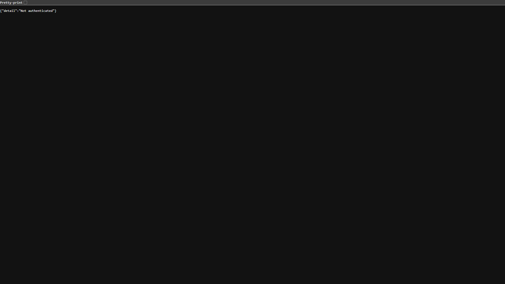

<p align="center">
  <h1 align="center">🛡️ Sentinel AI Platform</h1>
  <p align="center">
    <strong>Enterprise-Grade AI-Powered Security Vulnerability Management</strong>
  </p>
  <p align="center">
    <a href="#features">Features</a> •
    <a href="#architecture">Architecture</a> •
    <a href="#quick-start">Quick Start</a> •
    <a href="#api-reference">API</a> •
    <a href="#deployment">Deployment</a>
  </p>
</p>

---



---

## Overview

Sentinel AI is a **full-stack security vulnerability management platform** that combines automated scanning, AI-powered risk analysis, and real-time monitoring into a unified command center. It orchestrates industry-standard security tools (Nmap, Bandit, Semgrep, Trivy, Nikto, OWASP ZAP, Masscan) through an intelligent pipeline that deduplicates findings, scores risk using XGBoost ML models, detects false positives, and generates actionable attack graphs.

### Key Capabilities

- **Multi-Tool Scan Orchestration** — Parallel execution of 8+ security scanners with automatic target detection (IP, URL, Git repo, Docker image, CIDR)
- **AI/ML Risk Engine** — XGBoost-based risk scoring, false positive filtering, FAISS vector deduplication, and LLM-powered remediation guidance
- **Real-Time Dashboard** — 15 premium React pages with WebSocket-driven live scan monitoring, 3D threat visualization, and animated analytics
- **Enterprise Security** — JWT authentication with Redis-backed token revocation, RBAC, SSRF/DNS rebinding protection, rate limiting, audit logging
- **Distributed Architecture** — Kafka-based scan dispatch for horizontal scaling, with local subprocess fallback for single-node deployments

---

## Features

### 🔍 Scanning & Detection
| Feature | Description |
|---------|-------------|
| Network Scanning | Nmap (service detection, vuln scripts) + Masscan (fast port discovery) |
| Code Analysis | Bandit (Python security) + Semgrep (multi-language SAST) |
| Web Security | Nikto + OWASP ZAP + HTTP header analysis |
| Container Security | Trivy (image vulnerability scanning) |
| Advanced Pentesting | Pentagi (Docker-isolated penetration testing) |
| SSRF Protection | DNS rebinding prevention, cloud metadata IP blocking, RFC 1918 validation |

### 🤖 AI & Machine Learning
| Feature | Description |
|---------|-------------|
| Risk Scoring | XGBoost regressor trained on vulnerability features |
| False Positive Detection | XGBoost classifier with rules-based fallback |
| Finding Deduplication | Content hashing + FAISS semantic vector similarity |
| Attack Graph Generation | Automated exploit chain correlation |
| LLM Integration | GPT-powered remediation guidance and finding explanation |
| Drift Detection | Automated model performance monitoring with retraining scheduler |

### 📊 Dashboard & Visualization
| Feature | Description |
|---------|-------------|
| Command Center | 3D risk orb, global risk index, threat stream |
| Analytics | Risk trends, severity distribution, scan history, attack probability |
| Network Map | Force-directed graph topology visualization |
| Attack Graph | Visual exploit chain rendering |
| Live Scan Monitor | Real-time tool execution progress via WebSocket |
| Compliance | Multi-framework compliance reporting |

### 🔐 Security & Auth
| Feature | Description |
|---------|-------------|
| JWT Authentication | HS256 with 256-bit minimum secret enforcement |
| Token Revocation | Redis-backed JTI blacklist with TTL auto-expiry |
| RBAC | Admin, Analyst, Viewer roles with endpoint-level enforcement |
| Rate Limiting | Per-org Redis-backed SlowAPI with memory fallback |
| Audit Logging | Request-level audit trail for all authenticated operations |
| CORS Hardening | No wildcard origins — explicit allowlist required in production |

---

## Architecture

```
┌─────────────────────────────────────────────────────────────┐
│                    Frontend (React + Vite)                    │
│  ┌──────────┬──────────┬───────────┬──────────┬───────────┐ │
│  │CommandCtr│Analytics │ ScanMgmt  │ VulnExpl │ Settings  │ │
│  └────┬─────┴────┬─────┴─────┬─────┴────┬─────┴─────┬────┘ │
│       │ Axios    │ WebSocket │  Zustand  │  Recharts │      │
└───────┼──────────┼───────────┼───────────┼───────────┼──────┘
        │          │           │           │           │
┌───────┼──────────┼───────────┼───────────┼───────────┼──────┐
│       ▼          ▼           ▼           ▼           ▼      │
│              FastAPI Gateway (Uvicorn ASGI)                   │
│  ┌──────────────────────────────────────────────────────┐   │
│  │  Auth │ Scans │ Dashboard │ Vulns │ Assets │ AI │ DLQ│   │
│  └──┬───────┬────────┬──────────┬───────┬──────┬───────┘   │
│     │       │        │          │       │      │            │
│  ┌──▼──┐ ┌──▼──┐  ┌──▼───┐  ┌──▼──┐  ┌─▼──┐  │            │
│  │Redis│ │ PG  │  │Kafka │  │ ES  │  │MinIO│  │            │
│  └─────┘ └─────┘  └──┬───┘  └─────┘  └────┘  │            │
│                       │                        │            │
│                    ┌──▼────────────────┐       │            │
│                    │  Scan Workers     │       │            │
│                    │  (nmap, bandit,   │       │            │
│                    │   trivy, nikto)   │       │            │
│                    └──────────┬────────┘       │            │
│                               │                │            │
│                    ┌──────────▼────────┐       │            │
│                    │  AI/ML Pipeline   ├───────┘            │
│                    │  (XGBoost, FAISS, │                    │
│                    │   LLM, Dedup)     │                    │
│                    └──────────────────-┘                    │
└─────────────────────────────────────────────────────────────┘
```

### Technology Stack

| Layer | Technology |
|-------|-----------|
| **Frontend** | React 19, Vite 8, Tailwind CSS, Framer Motion, Recharts, Three.js, Zustand |
| **Backend** | Python 3.11+, FastAPI, SQLAlchemy (async), Pydantic v2 |
| **Database** | PostgreSQL 16 (primary), Redis 7 (cache/pubsub), Elasticsearch 8 (search) |
| **Messaging** | Apache Kafka (KRaft mode, no Zookeeper) |
| **AI/ML** | XGBoost, scikit-learn, FAISS, Sentence Transformers, OpenAI GPT |
| **Storage** | MinIO (S3-compatible object storage for reports) |
| **Observability** | Prometheus, Grafana, Sentry, OpenTelemetry (OTLP) |
| **CI/CD** | GitHub Actions, Docker, Kubernetes (staging/production) |

---

## Quick Start

### Prerequisites

- **Docker** & **Docker Compose** v2+
- **Node.js** 20+ (for frontend development)
- **Python** 3.11+ (for backend development)

### 1. Clone & Configure

```bash
git clone https://github.com/sahilsalgaonkar/sentinel-platform.git
cd sentinel-platform
cp .env.example .env    # Edit with your secrets
```

### 2. Start Infrastructure

```bash
# Start all services (PostgreSQL, Redis, Kafka, Elasticsearch, MinIO)
docker compose up -d

# Wait for services to be healthy
docker compose ps
```

### 3. Initialize Database

```bash
# Run database migrations
pip install -r requirements.txt
python -m alembic upgrade head

# (Optional) Seed an admin user
python seed_admin.py
```

### 4. Start Backend

```bash
python run.py
# → Gateway running at http://localhost:8000
# → API docs at http://localhost:8000/docs
```

### 5. Start Frontend

```bash
cd frontend
npm install
npm run dev
# → UI running at http://localhost:5173
```

### 6. Verify

Open **http://localhost:5173** → Login → Navigate to Command Center.

---

## API Reference

The API is fully documented via **OpenAPI/Swagger** at `/docs` when the gateway is running.

### Core Endpoints

| Method | Endpoint | Description |
|--------|----------|-------------|
| `POST` | `/api/auth/register` | Create account + organization |
| `POST` | `/api/auth/login` | Obtain JWT access token |
| `POST` | `/api/auth/refresh` | Rotate token (old JTI blacklisted) |
| `POST` | `/api/auth/logout` | Revoke token via Redis blacklist |
| `GET` | `/api/scans/` | List scans (paginated, org-scoped) |
| `POST` | `/api/scans/` | Create new scan |
| `GET` | `/api/scans/{id}/findings` | Get scan findings |
| `GET` | `/api/dashboard/stats` | Aggregated risk metrics |
| `GET` | `/api/dashboard/command-center` | Full command center payload |
| `GET` | `/api/dashboard/analytics` | Charts, trends, distributions |
| `GET` | `/api/dashboard/ai-insights` | AI-generated security insights |
| `GET` | `/api/vulnerabilities/` | List vulnerabilities |
| `GET` | `/api/vulnerabilities/stats/summary` | Severity breakdown |
| `POST` | `/api/ai/risk-score` | ML-based risk scoring |
| `POST` | `/api/ai/false-positive` | FP detection check |
| `GET` | `/api/ai/attack-graph` | Force-directed attack graph |
| `POST` | `/api/ai/chat` | AI security chatbot |
| `GET` | `/api/assets/` | Asset inventory |
| `GET` | `/api/alerts/dlq` | Alert DLQ management |
| `GET` | `/health` | Service health check |

### Authentication

All endpoints (except `/health`, `/auth/login`, `/auth/register`) require a Bearer JWT:

```bash
curl -H "Authorization: Bearer <token>" http://localhost:8000/api/scans/
```

---

## Deployment

### Docker Compose (Development)

```bash
docker compose up -d          # Core services
docker compose -f docker-compose.minimal.yml up -d  # Full stack with gateway + workers
```

### Kubernetes (Production)

Production manifests are in `k8s/`:

```bash
kubectl apply -f k8s/namespace.yaml
kubectl apply -f k8s/secrets.yaml        # ExternalSecret (no plaintext)
kubectl apply -f k8s/configmap.yaml
kubectl apply -f k8s/gateway.yaml
kubectl apply -f k8s/workers.yaml
kubectl apply -f k8s/frontend.yaml
kubectl apply -f k8s/ingress.yaml
kubectl apply -f k8s/hpa.yaml
```

### CI/CD Pipeline

The GitHub Actions workflow (`.github/workflows/main.yml`) runs:

1. **Backend Quality Gate** — Black formatting, Flake8 lint, Bandit security scan, pytest
2. **Frontend Build** — ESLint + Vite production build
3. **Container Security** — Trivy scan on gateway/worker images
4. **Docker Build & Push** — Multi-image build to GHCR (main branch only)
5. **Deploy to Staging** — Kubernetes rolling update with health verification

---

## Environment Variables

See [`.env.example`](.env.example) for the full list. Key variables:

| Variable | Required | Description |
|----------|----------|-------------|
| `DATABASE_URL` | ✅ | PostgreSQL connection string (`postgresql+asyncpg://...`) |
| `JWT_SECRET` | ✅ | Min 256-bit secret for JWT signing |
| `REDIS_URL` | ⚠️ | Redis connection (degrades gracefully without) |
| `CORS_ALLOWED_ORIGINS` | ✅ | Comma-separated allowed origins (no wildcards) |
| `LLM_API_KEY` | ⚠️ | OpenAI/compatible API key for AI features |
| `S3_ENDPOINT` | ⚠️ | MinIO/S3 endpoint for report storage |
| `KAFKA_BOOTSTRAP_SERVERS` | ⚠️ | Kafka brokers (falls back to local execution) |
| `ELASTICSEARCH_URL` | ⚠️ | ES endpoint (falls back to PostgreSQL LIKE) |
| `SENTINEL_EXECUTION_MODE` | — | `local` or `distributed` (default: `local`) |

---

## Project Structure

```
sentinel-platform/
├── backend/
│   ├── common/              # Shared config, database, ES client
│   ├── gateway/
│   │   ├── main.py          # FastAPI entrypoint + lifespan
│   │   ├── middleware/       # Auth (JWT), audit logging
│   │   └── routes/          # 13 route modules
│   ├── services/
│   │   ├── scan_control/    # Orchestrator, models, tool executor
│   │   ├── ai_intelligence/ # ML pipeline (risk, FP, dedup, attack graph)
│   │   ├── identity/        # User/org management, RBAC
│   │   └── kafka/           # DLQ consumer, result processor
│   ├── schemas/             # Pydantic request/response models
│   └── tests/               # Integration + unit tests
├── frontend/
│   ├── src/
│   │   ├── api/             # Axios client with JWT interceptors
│   │   ├── pages/           # 15 React pages
│   │   ├── components/      # Reusable UI components
│   │   └── stores/          # Zustand state management
│   └── package.json
├── docker/                  # Dockerfiles (gateway, worker, frontend, AI)
├── k8s/                     # Kubernetes manifests
├── .github/workflows/       # CI/CD pipeline
├── docker-compose.yml       # Development infrastructure
├── docker-compose.minimal.yml  # Full stack deployment
├── requirements.txt         # Python dependencies
├── alembic/                 # Database migrations
└── docs/                    # Additional documentation
```

---

## Security

- **Vulnerability Reporting**: Please report security vulnerabilities responsibly by contacting the maintainers directly.
- **Secrets**: Never commit `.env` files. Use `.env.example` as a template. The `.gitignore` blocks `.env`, `*.key`, `*.pem`, and `secrets/`.
- **SSRF Protection**: All scan targets are resolved and validated against RFC 1918, link-local, and cloud metadata IP ranges before execution.
- **JWT Hardening**: Tokens require `exp` and `sub` claims; secrets under 256 bits are rejected at startup.

---

## License

This project is proprietary software. All rights reserved.
